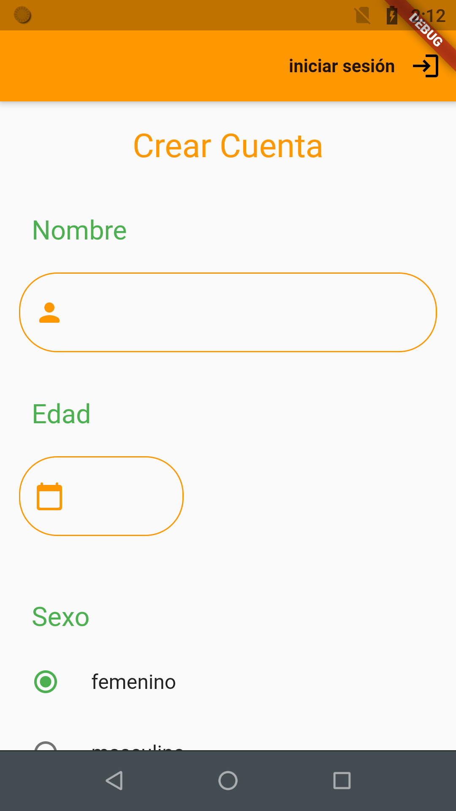
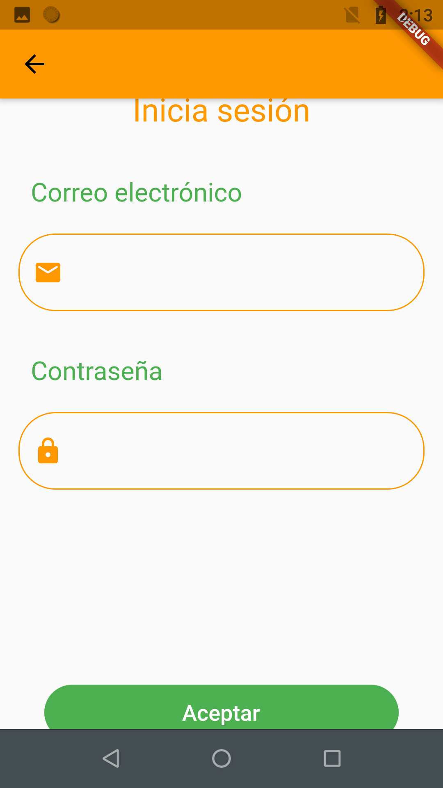
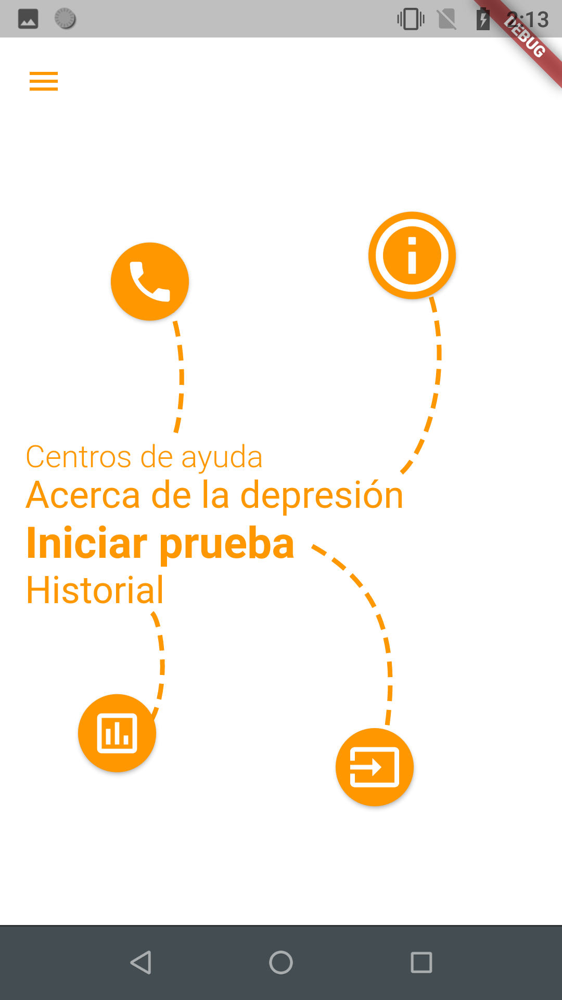
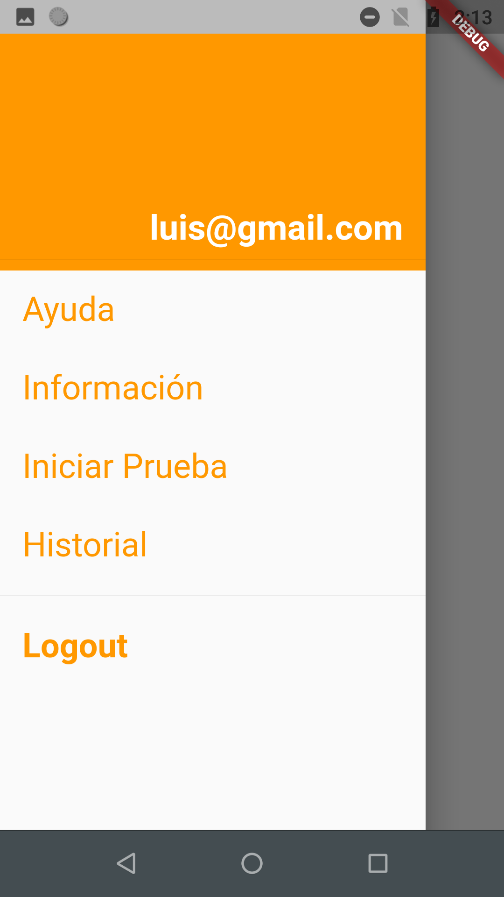
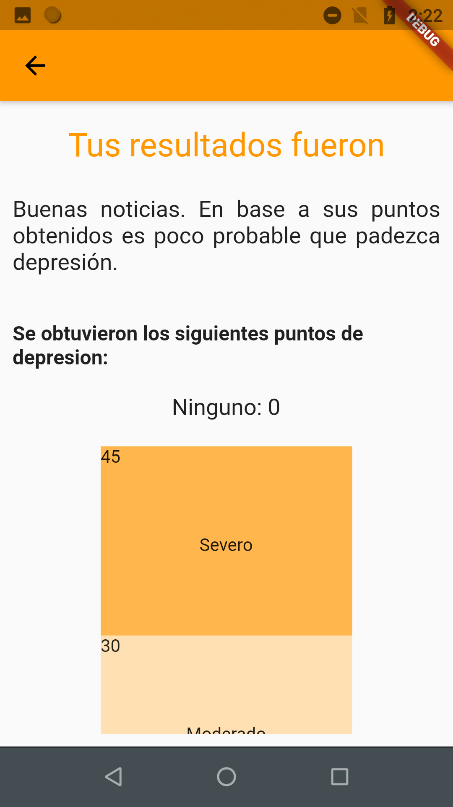
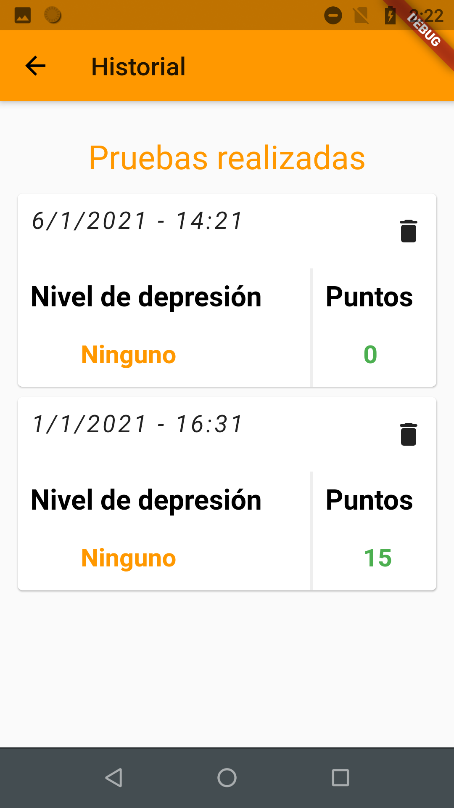

## diagnostico_depresion
This app assists in the diagnostic and treatment of depression; it is not meant to be used stand-alone. It's intended use is as a tool recomended by medical professionals.

# Dart with Flutter and Firebase
We use the Firebase Dart API to save user info in a NoSQL database in the cloud. Firebase has some advantages over in-device storage; If you lose your device, your info is stored in the cloud. It also caches the data to disk in case of an offline device, and syncronizes when the device is online again.

# User registration and login
The starter page asks for registration; if you already have an account just press login.

  

Login page:

  

The user credentials are stored in the cloud; specifically on Google Firebase.

# Home
Hub for various screens.

  

  

# Tests and history

  

The app saves the test results in Firebase; it retrieves them when the 'History' page is accessed.

  

